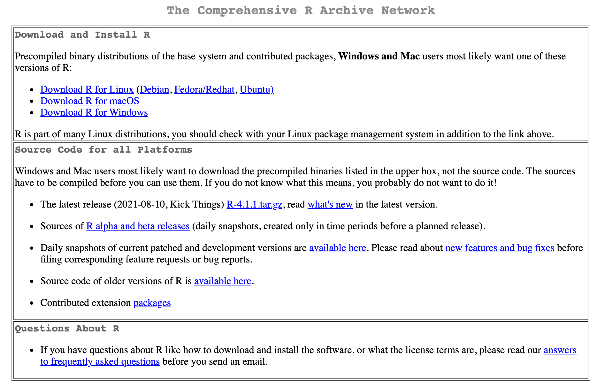
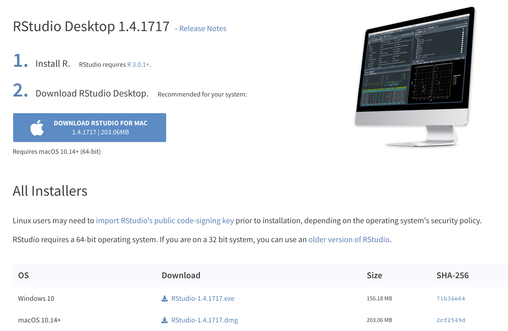
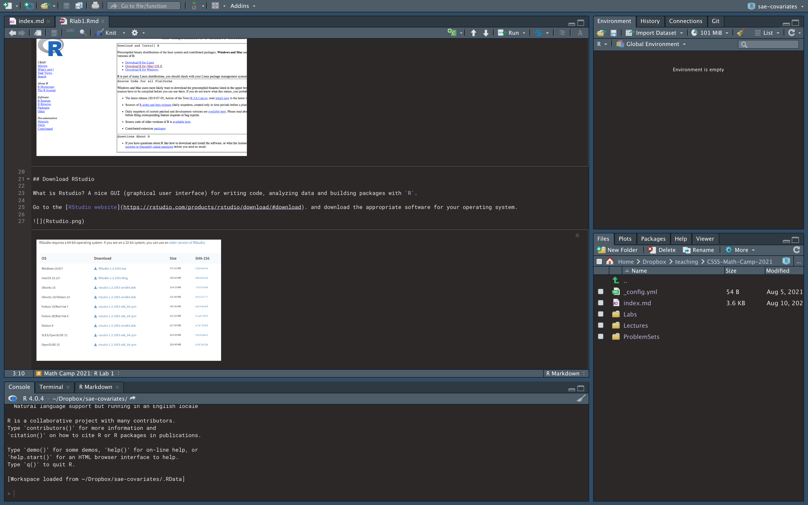
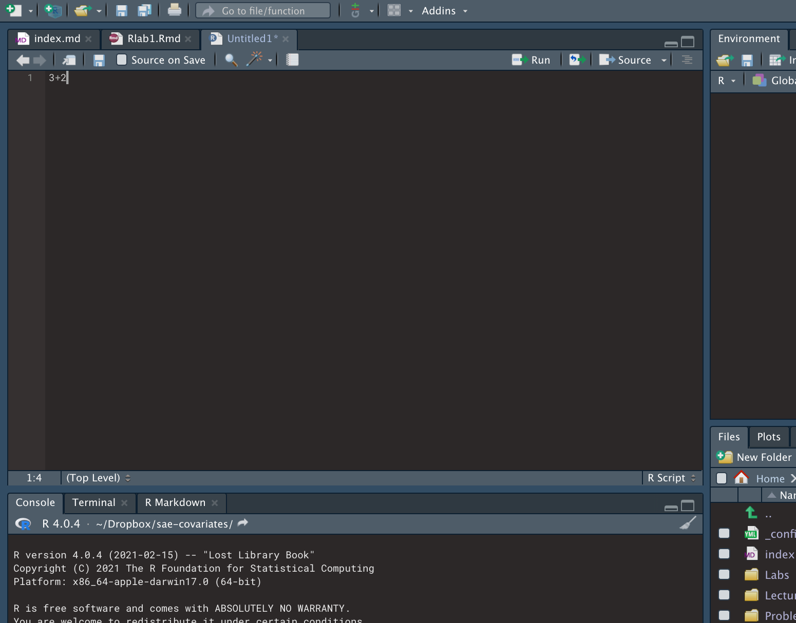
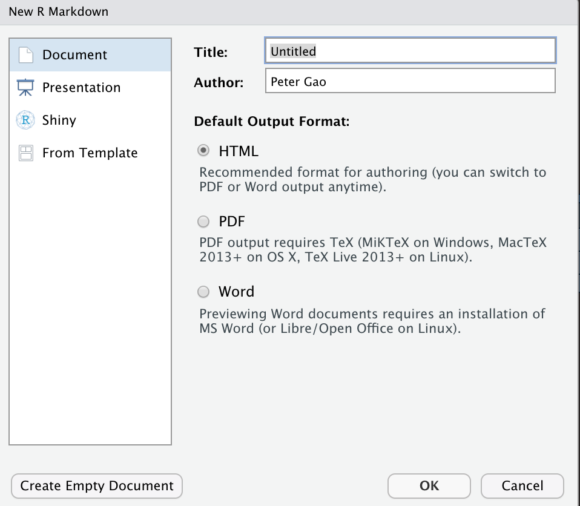
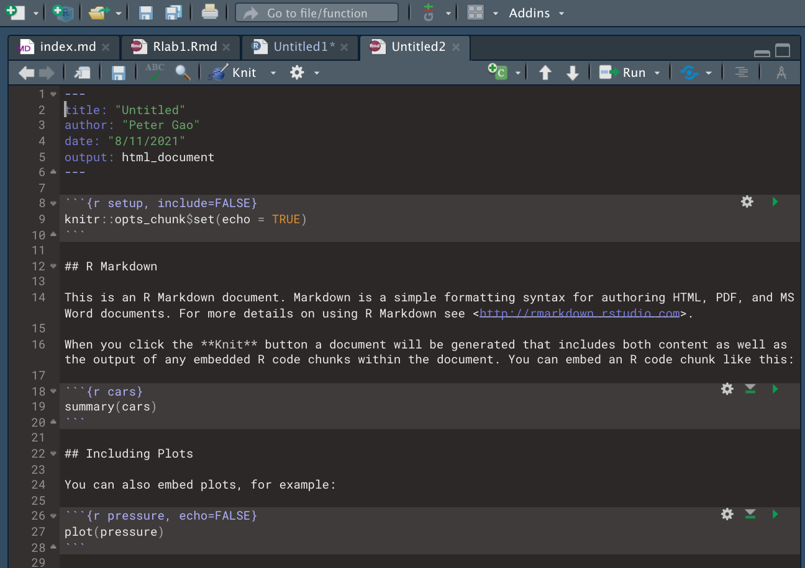

## Download R

What is `R`? Open-source, free, statistical computing software.

Go to the [R website](https://cran.r-project.org/), and download the appropriate software for your operating system.



## Download RStudio

What is Rstudio? A nice GUI (graphical user interface) for writing code, analyzing data and building packages with `R`.

Go to the [RStudio website](https://rstudio.com/products/rstudio/download/#download). and download the appropriate software for your operating system.



### Rstudio Layout

Rstudio has four main panels that allow you to organize your code and have a better user experience developing and using `R` code: 

  * Source panel: where scripts are edited
  * Console panel: where code is executed and output is printed
  * Environment panel: where objects are stored
  * Files/Plots/Help: navigate files and folders, view plots, read and access help documentation for packages and functions




## R as a calculator

Open a new .R script by clicking File $\rightarrow$ New File $\rightarrow$ R Script. We can execute code by highlighting it in a source file and clicking the run button.\


We can also execute code by typing it directly into the console and pressing enter.


We can do basic mathematical computations using +,-, *, /, and ().\

Note: `pi` is hard coded into `R`.\


```r
2+3
```

```
## [1] 5
```

```r
6*7
```

```
## [1] 42
```

```r
pi*1  
```

```
## [1] 3.141593
```

```r
6*3/2-3
```

```
## [1] 6
```

```r
6*3/(2-3)
```

```
## [1] -18
```

```r
1/0
```

```
## [1] Inf
```

Try some on your own!\

What about more complicated functions like exponents, square roots, trig functions and the natural logarithm?\


```r
3^2
```

```
## [1] 9
```

```r
2^(3+2)
```

```
## [1] 32
```

```r
sqrt(9)
```

```
## [1] 3
```

```r
sin(2*pi)
```

```
## [1] -2.449294e-16
```

```r
log(1000)  
```

```
## [1] 6.907755
```

```r
exp(6.907755)   
```

```
## [1] 999.9997
```

Note: \texttt{log()} computes the natural logarithm. See \texttt{?log} to compute a logarithm with a different base.\

### Documentation
One convenient feature in \texttt{R} is the documenation for all functions. If you want to learn more about a function and its arguments you can simply type a question mark in front of the function name or use the \texttt{help()} function.

```r
?log
help("log")
```

### Question
According to the above help files, what function (or functions) would you need to use for a base 10 logarithm?\

There are a few other functions that can help you understand how to use functions or recall their arguments.


```r
help.search("log")
args(log)
```

## Objects
Numbers, formulas, and other statistical information can be stored as objects in R.  \

Objects are given names and then are stored in the working environment. Once they are stored, the information remainds "hidden" until referenced again. If you are using RStudio the object names can be seen in the Environment module.\

Notes:

  *  Object names are case-sensitive
  *  Object names should be meaningful and short (``best practice'')
  *  `<-` is most common, but `=` is acceptable


```r
x<-2 #Creates the object "x"
x    #Shows the contents of object "x"
```

```
## [1] 2
```

```r
y=3.5
y
```

```
## [1] 3.5
```

```r
h<-"practice"   #You can also put strings in an object
h
```

```
## [1] "practice"
```

Objects can be numbers, strings, matrices, or even more complicated `R` objects.\
Examples of `R` object types:

  *  the computing basics: integer, numeric, vector, matrix, list
  *  data.frame
  *  factor
  *  lm object (linear model object)
  *  formula


There are handy functions for seeing whether or not an object is of a certain type. These functions are usually important for debugging and making sure you are inputing the proper object type into a function argument.


```r
is.integer(y)
```

```
## [1] FALSE
```

```r
is.numeric(y)
```

```
## [1] TRUE
```

```r
is.character(h)
```

```
## [1] TRUE
```

```r
is.matrix(x)
```

```
## [1] FALSE
```

The function \texttt{ls()} will list all of the objects that have been created:

```r
ls()
```

```
## [1] "h" "x" "y"
```

Here we see we have in our environment the objects we created \texttt{x, y, h}. If we assign a new value to \texttt{x} it will overwrite what is already stored in that object


```r
x     #Original object that we created above.
```

```
## [1] 2
```

```r
x<-7  #New object with same name
x     #New object
```

```
## [1] 7
```

## R Markdown

Markdown is a simple formatting syntax for authoring HTML, PDF, and MS Word documents. For more details on using R Markdown see <http://rmarkdown.rstudio.com>. RMarkdown is a nice program within RStudio that allows us to typset documents and incorporate code and output. This is helpful for writing labs for you all to follow along with, but also to create reproducible and replicable research. It allows you to avoid writing scripts to produce all your output and then copy and pasting that output into a word processing software which may induce unnecessary errors in your work.

Go to File $\rightarrow$ New File $\rightarrow$ R Markdown. Select `Knit to HTML`



It will open up a new template .Rmd file for you to begin editing that will look like this:\



When you click the **Knit** button a document will be generated that includes both content as well as the output of any embedded R code chunks within the document. You can embed an R code chunk like this:


```r
data(cars)
summary(cars)
```

```
##      speed           dist       
##  Min.   : 4.0   Min.   :  2.00  
##  1st Qu.:12.0   1st Qu.: 26.00  
##  Median :15.0   Median : 36.00  
##  Mean   :15.4   Mean   : 42.98  
##  3rd Qu.:19.0   3rd Qu.: 56.00  
##  Max.   :25.0   Max.   :120.00
```


A handy Rstudio/R Markdown cheatsheet can be found [here](https://peteragao.github.io/CSSS-Math-Camp-2021/Labs/rmarkdown.pdf). It gives summaries of the most used Markdown syntax aspects (e.g. headings/subheadings, bullet lists, numbered lists), the types of files R Markdown can create and examples of how R and R Markdown interact.

This is an example of an an R Markdown file that will be used to create a .html file. This is the best option if you don't have much math to write or do not need to share a .pdf.

### Why use R Markdown?

* Reproducibility: the results in the final come directly from the code include in the file
* Replicability: a collaborator or another researcher or student can directly replicate your analysis using the code in the chunks and there is room for much more commentary than in a regular script file.
* Debugging: every time you knit a .Rmd file, it executes the code from start to finish in a clean environment. it will not compile if there are errors in the \tt{R} code, the Markdown syntax or, if we are making a .pdf, the \LaTeX code.

### Chunks

While not nicely named, R code can be included in an R Markdown file in what we call a "chunk". Properties of the chunk are adjusted within the curly braces. The cheatsheet under the heading "Embed code with knitr syntax". The most common arguments I use are


  *  `echo`: logical argument determining whether the code in the subsequent chunk will be printed in the document created
  *  `eval`: logical argument determining whether or not the code in the subsequent chunk will be evaluated by `{R}$ or just printed in the document.
  *  `fig.cap`: provides a caption for a figure
  *  `fig.align`: aligns figure on "left", "right" or "center"


<div class="figure" style="text-align: center">

<p class="caption">For example, this figure was created with 	t{echo = FALSE} and 	t{eval = TRUE.}</p>
</div>

Chunks allow you to break up your code into smaller pieces that a reader can understand. It's great for writing reports/homeworks so that you can include code immediately followed by its output.\

#### `purl()`

You can use the function `purl()` on a .Rmd document and it will create a new `.R` file with only the R code in the chunks. Copy and paste the following code line by line into your document to create a document called `Rlab1.R` containing only the `R` code in this document.


```r
install.packages('knitr', dependencies = T)
library(knitr)
purl('Rlab1.Rmd')
```

### Formatting

All of this is available on the cheat sheet, but here we will briefly cover basic text and document formatting.

#### Bold/Italics
Use asterisks (`*`) around a word or phrase to make it *italicized*.

Use double asterisks (`**`) around a word or phrase to make it **bold**.

In R Markdown, these formatting tools will create highlighted text.

### Math mode

If you want to write equations you can use (`$`) like in \LaTeX.

Wrap an equation in a single `$` to write an equation in "math mode": $y = x$.

Wrap an equation in double dollar signs (`$$`) to make an equation block in math mode: $$ y = x $$.

In a .pdf file you can also include raw \LaTeX code, and use and equation or align environment:

\begin{equation}
y = x.
\end{equation}

### If/Then

### Loops

### Functions

### Exercises 

1. How would you compute the mean/median/mode for the following set of numbers: ```4, 4, 5, 7, 7, 8, 10, 12, 13, 14```?

2. How would you compute $\sin(2\pi/3)$?

3. Take a look at the following definition of ```f```. What is ```f(5)```?

    
    ```r
    f <- function(x) {
      if (x > 10) {
        return(1)
      } else{
        return(0)
      }
    }
    ```

4. Suppose you run the following chunk of code. What is ```x``` after running the code? What is ```y```? Check your answer by running the code.

    
    ```r
    x <- 5
    y <- x + 1
    if (x < 10) {
      x <- 1
    }
    ```


5. Suppose you run the following chunk of code. What is ```x``` after running the code? What is ```y```?

    
    ```r
    x <- 2
    y <- 2
    for (i in 1:3) {
      x <- x * x
      y <- y * 2
    }
    x
    ```
    
6. How could you write code to calculate $1\times 2\times 3\times\cdot\times 99\times 100$?
